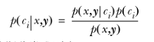
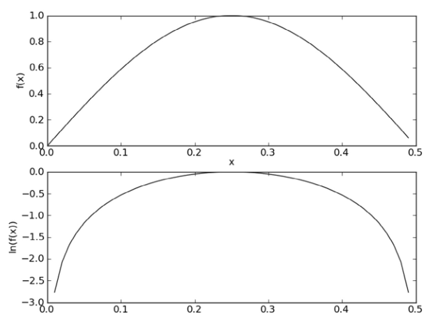
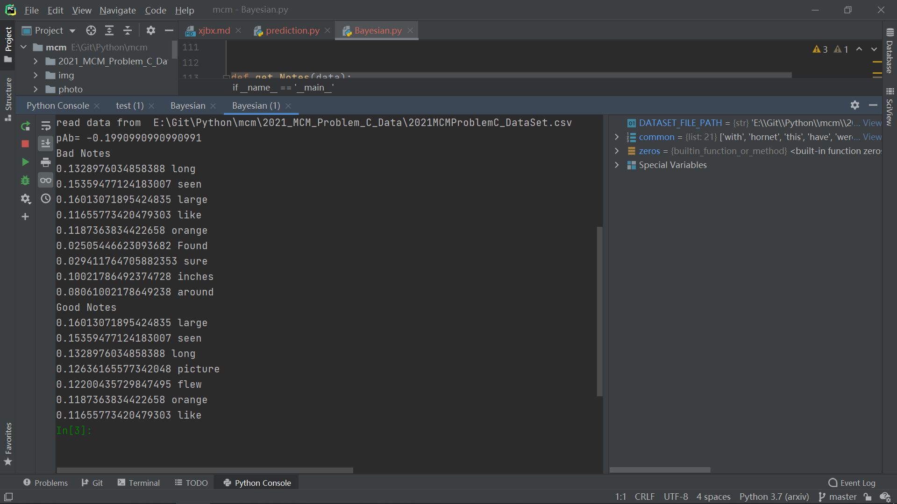
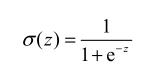

# 第二题
## 概述
为了构造一个满足要求的预测错误分类可能性的模型，我们决定使Logistic回归模型，以实现高效、准确地分类。
通过调查资料，考虑到加拿大当地的风向、自然环境、黄蜂的生活习性、活动范围、以及举报信息中照片质量、评论
等多个方面的因素。我们确定将距离、方向、举报信息照片质量、举报信息评论的关键字作为该模型的特性值，并选
取合理的训练集以及测试集数据训练模型，最终模型的准确率高达99%。

## 处理未定义数据
首先，我们为了解决数据中存在大量未定义（即未处理或无法处理举报信息）的数据。我们使用了机器学习的图像技术
通过分析已定义数据的实验室评论以及照片的学习，来预测未定义数据的可信度。并且以此为特征值。如此我们实现将
未定义数据纳入预测模型，充分的扩大了可以使用的数据集，显著提高模型的鲁棒性以及准确性

## 贝叶斯概率预测评论
我们为了从举报者的Notes获取有用的信息，辅助我们预测错误。我们的基本思想是先统计在数据集中关键字的次数，然后除以数据集中
实力的总数，以获取该值的概率。根据已获得的概率值我们就可以使用条件概率进行分类。由贝叶斯准测得到：

由此我们定义贝叶斯分类准测：
* 如果p（c1|x,y）> p(c2|x,y),那么属于类别c1
* 如果p（c2|x,y）< p(c2|x,y),那么属于类别c2

使用贝叶斯准测，我们就可以通过已知的三个概率值来计算未知的概率值，也就是我们所关心的特定关键字出现哪种评论的概率
以此为基础我们使用朴素贝叶斯分类器（我们假设关键字间相互独立以及关键字的特征同等重要）
我们首先从文本中构建词向量，我们将Notes中出现的有用的单词纳入词向量中，同时将语句中的代词，谓词等对于预测无用的词汇 
排除，由此构建属于该模型的词汇表。
获得词汇表后，便统计Notes中的出现在词汇表的单词的曾出现次数同时进行排序。 
接着我们使用训练算法从词向量中计算概率：p(ci|w)=p(w|ci)p(ci)/p(w) 此处的w为词向量
首先我们通过类别i（positive、negative、unprocess）中Notes数目除以总Notes数计算概率p(ci)
接着使用朴素贝叶斯假设计算p(w|ci)由于词向量中每个单词假设为独立的，上述概率可以写作p(x1|ci)p(x2|ci)p(x3|ci)····p(x|ci)n
极大的简化了计算过程。计算的过程中为了解决下溢出的问题（概率太小相乘导致溢出）我们使用对乘积取自然对数（In(a*b)=In(a)+In(b)）

现在我们已经实现了一个朴素贝叶斯分类器，分类器成功提取出positive ID中Notes以及Negative ID中Notes中关键字以及出现该词的情况下该举报信息
为相应类别的概率。

由此，我们可以通过计算举报信息Notes中关键字给出相应的评分作为特征值，供进一步的机器学习使用。

## 方向、距离

## Logistic回归
有了以上我们提取出来的特征值，我们就可以利用Logistic回归进行拟合。该模型可以看作一个二值型输出分类器，我们预期的函数输出为0或1。在此我们使用
Sigmoid函数实现这一点。

为了实现Logistic回归分类器，我们可以在每个特性上都乘以一个回归系数，再把所有的结果相加，将这个总和代入Sigmoid函数，进而得到一个范围在0-1间的
数值。任何大于0.5的数据我们就认为是positive的，而小于0.5的被视为Negative的。因此，Logistic回归也可以看作是一种概率估计。

确定分类器函数形式后，我们使用随机机梯度上升算法获取最佳回归系数，在避免计算复杂度过大的情况下，同时在新样本到来时对分类器进行增量式更新（即在线
学习算法）。与梯度上升实现过程中不同的地方在于每次训练的alpha都会进行调整，并且会随机选择样本来更新回归系数。正是在此处的不同使得随机梯度上升算法
对于回归系数的收敛更快,收敛效果也更好。

